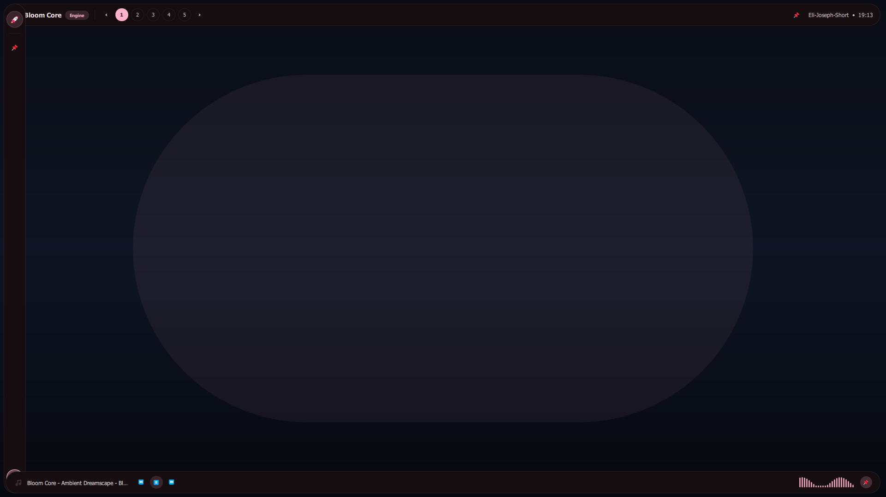
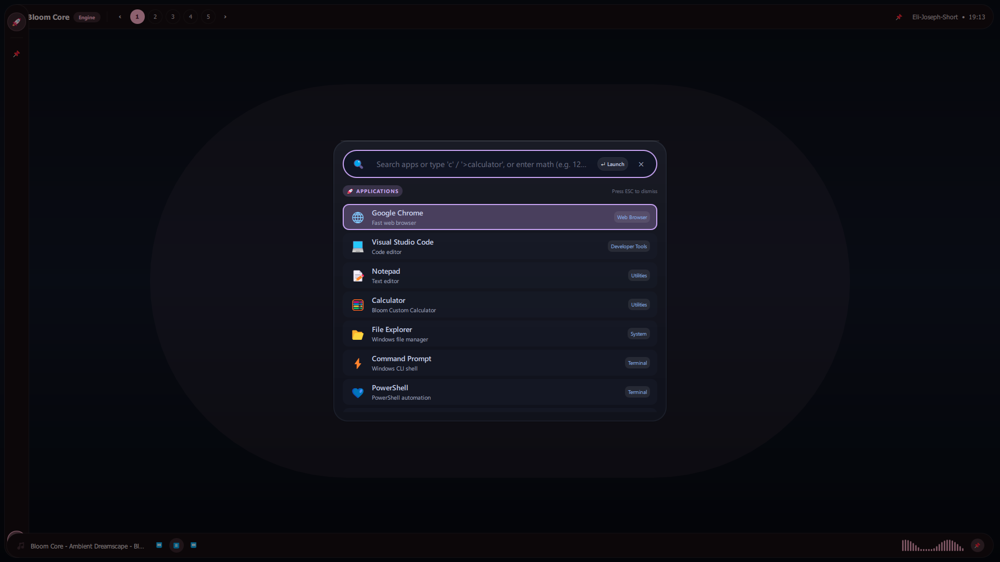

# Bloom Core

<p align="center">
  <strong><a href="README.md">English</a> | 日本語</strong>
</p>

<p align="center">
  
</p>

<p align="center">
  <em>Bloom Core — トップステータスバー、仮想デスクトップ切り替え、スマートボトムメディア＆スペクトラムドック</em>
</p>

<p align="center">
  
</p>

<p align="center">
  <em>Smart Launcher Modal — 高速アプリ検索、インライン電卓、コマンド実行</em>
</p>

---

**Bloom Core** は、Windows 向けのハイパフォーマンス・次世代デスクトップシェルエンジンです。  
C++20 と Qt 6 (Qt Quick / QML) をベースに構築され、Arch Linux（Hyprland / Quickshell / Caelestia Shell）向けに作られた宣言的 QML ウィジェットやシェルを Windows 上で動かすための **「OSブリッジ（互換）レイヤー」** を備えています。

---

## 主な特徴

### 1. アイコニックな起動モデル (Hold-to-Arm)
- **`Ctrl + Win` (長押し)**: デスクトップを即座にディム（薄暗く減光）し、シェルを召喚。キーを離すと瞬時に元の作業画面へ復帰。
- **`Ctrl + Win + Space`**: オーバーレイのロックトグル（キーを離しても常時表示）。
- **`Esc` キー / 外側クリック**: モーダルおよびアーム状態を即座に安全解除。
- フォーカス強奪を排除したスマート設計で、他の作業を一切邪魔しません。

### 2. 高精度 WASAPI Loopback リアルタイム FFT オーディオ解析
- Windows の既定オーディオエンドポイントをループバックキャプチャし、システム全体の音声をリアルタイム解析。
- **1024点 Hann窓 Cooley-Tukey FFT** による 40Hz〜16kHz 対数帯域スペクトラム（96 / 24バンド）。
- **16-bit / 24-bit / 32-bit 整数 PCM および IEEE 32-bit Float** の全サンプリング形式にネイティブ対応。
- ヘッドホン抜き差しや既定デバイス切り替え時にもクラッシュせず自動再接続する堅牢なフェイルセーフ。

### 3. スマートボトムバー (Smart Media & Spectrum Dock)
- 音楽再生中のみ自動でスライドイン＆フェードイン。
- 曲の停止・無音時には自然にディケイ（減衰）したのち、**自動で静かに画面外へ退避して消える** ミニマル設計。
- 📌 ピン留め機能により常時固定表示も可能。

### 4. スマートランチャーモーダル (Smart Launcher)
- ロケットアイコン（🚀）またはショートカットで起動。
- アプリ高速検索、インライン電卓（`>calc` / 数式直接入力）、コマンドプロンプト実行をワンストップで統合。

### 5. 壁紙連動の動的パレット生成 (Dynamic Wallpaper Palette)
- Linux の `matugen` に代わる独自の **[PaletteEngine](src/services/PaletteEngine.h)** を内包。
- Windows の現在の壁紙画像をリアルタイム解析し、調和する Material Design 3 カラーパレット（`Colours.m3primary`, `Colours.m3surface` など）を QML シングルトンへ即座に供給。

### 6. Arch / Linux (Quickshell & Hyprland) 互換ブリッジ
Linux の dotfiles や Caelestia Shell 等の QML コードを最小限の変更で Windows 上に召喚できます：
- **`import Quickshell.Hyprland`**: `Hyprland.workspaces`, `Hyprland.activeWsId`, `Hyprland.dispatch("workspace 2")` などを Windows 11 の仮想デスクトップ API に自動変換。
- **`import Quickshell.Services.Mpris`**: MPRIS 互換のプレイヤー操作（Spotify / ブラウザ YouTube などの再生・曲送り）を Windows メディアキー制御へ橋渡し。
- **`import Quickshell.Services.Pipewire`**: 音量スライダーやミュート状態を Windows オーディオエンドポイントへ直結。
- **`import Caelestia`**: `Colours`, `Tokens` を Windows パレットに透過マッピング。

### 7. ネイティブ QML API (`import Bloom`)
- `Colours`: 動的 M3 パレット
- `Shell`: アーム／ロック状態と操作
- `Workspaces`: 仮想デスクトップ管理
- `SysInfo`: CPU、RAM、バッテリー、稼働時間、音量
- `Players`: メディア再生・曲名・アーティスト
- `Audio`: WASAPI ループバック高精度 FFT オーディオスペクトラム（CAVA 互換）
- `Weather`: 天気・気温・湿度

---

## 使い方・CLIランナー

```powershell
# デフォルトシェルを起動（Hold-to-Armで Ctrl+Win）
.\BloomCore.exe

# 任意の外部 QML ファイルを指定してシェルを起動
.\BloomCore.exe path/to/my_shell.qml
.\BloomCore.exe -s path/to/my_shell.qml

# 既に起動している Bloom Core を召喚 / トグル
.\BloomCore.exe --show
.\BloomCore.exe --toggle
```

※ デフォルトでは、`%USERPROFILE%/.config/bloom/shell.qml` が存在すれば自動的に読み込みます。存在しない場合は同梱の参照シェル（`DefaultShell.qml`）が起動します。

---

## ビルド方法

### 前提環境
- Qt 6.5 以上 (Core, Gui, Qml, Quick, QuickControls2, QuickLayouts, Network)
- C++20 対応コンパイラ (MinGW 64-bit または MSVC)
- CMake 3.21 以上 & Ninja

### ビルド手順 (PowerShell)
```powershell
cmake -S . -B build-mingw -G Ninja -DCMAKE_PREFIX_PATH=C:/Qt/6.11.1/mingw_64
cmake --build build-mingw --config Release
```
または、ルート直下の `build.bat` を実行してください。
ビルド後、`run_bloom_core.bat` で直接テスト起動できます。

---

## ライセンス
GPL-3.0 License
